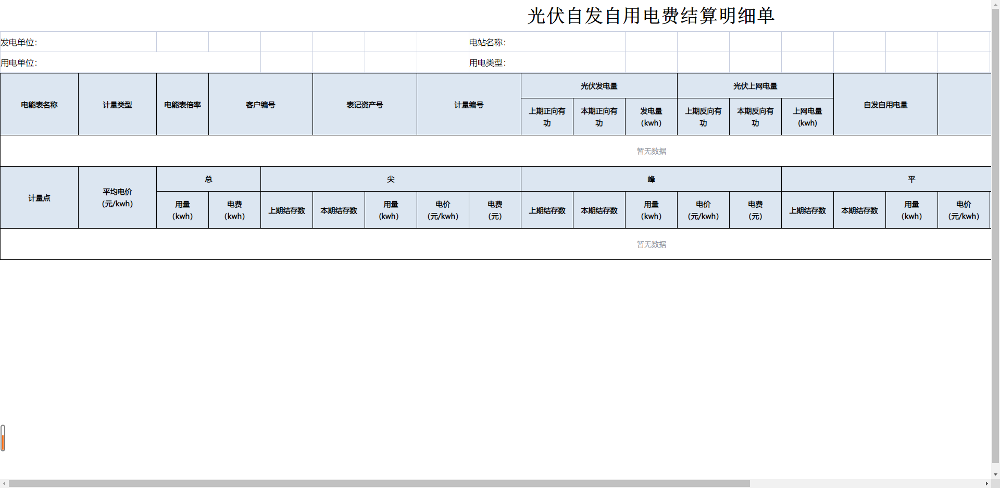

## 组件预览

---
## 用户输入 
### buttons
**`字段描述`**
展示按钮所需要的配置项,defaultValue为默认选中，可为空
**`样例`**

>{
      defaultValue: "战勤部",
      data: [
        {
          label: "战勤部",
          value: "战勤部"
        },
        {
          label: "政治工作部",
          value: "政治工作部"
        },
        {
          label: "基层一队",
          value: "基层一队"
        },
        {
          label: "基层二队",
          value: "基层二队"
        },
        {
          label: "基层三队",
          value: "基层三队"
        },
        {
          label: "基层四队",
          value: "基层四队"
        },
        {
          label: "基层五队",
          value: "基层五队"
        },
        {
          label: "基层六队",
          value: "基层六队"
        }
      ]
    }

### id
**`字段描述`**
唯一标识，可不填
**`样例`**
>db5d25a6-b167-4ead-b7eb-ef6510f3b7ee
---
## 逻辑控制
### events
#### valueChange
**`字段描述`**
值改变事件
**`提供数据`**
+ **数据名称**:改变之后的值
+ **数据类型**:string
+ **数据样例**：基层五队
